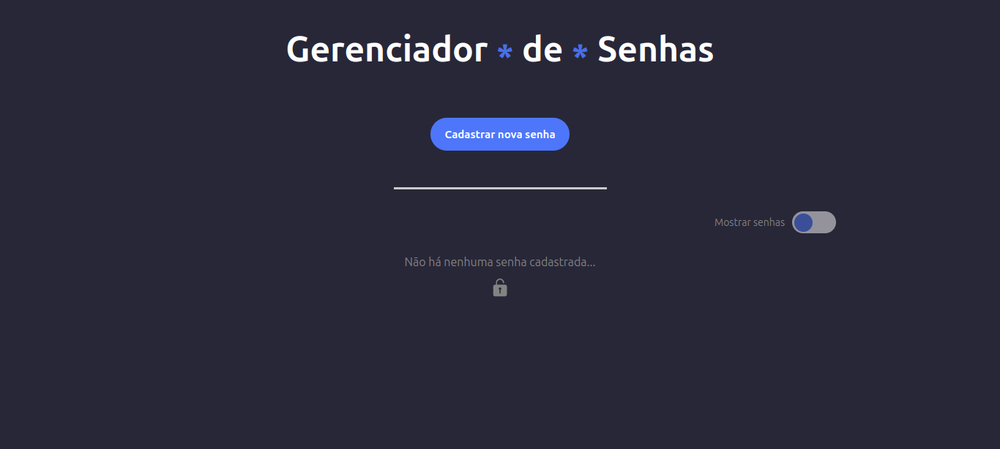
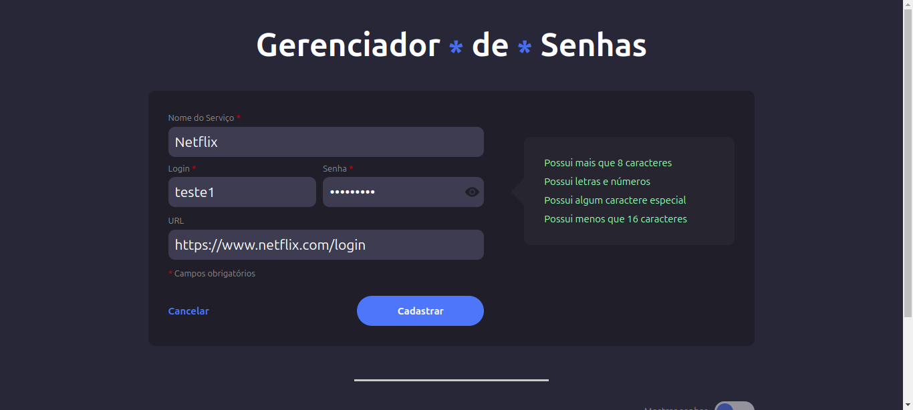
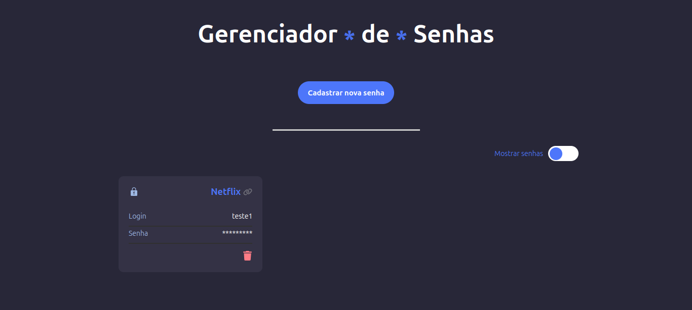
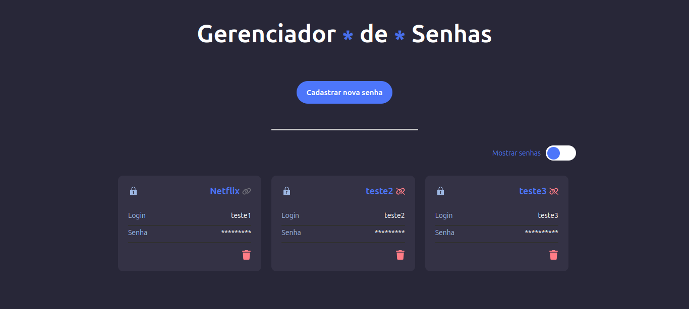

# Password Manager 🔒

Este é um projeto proposto pela Trybe, onde o objetivo é fornecer à pessoa usuária uma ferramenta para que possa gerenciar as senhas dos serviços que usa. Salvando-as para conferir posteriormente caso hajam esquecimentos.

## Deploy Link 🌐

### Acesse o deploy do meu projeto 👉 [Netlify](https://ipdomain-tracker.netlify.app/)

## Tabela de Conteúdos

- [Visão Geral](#overview)
  - [O desafio](#o-desafio)
  - [Screenshots](#screenshots)
- [Desenvolvimento](#desenvolvimento)
  - [Características Técnicas](#características-tecnicas)
- [Autor](#autor)

## Visão Geral 🔎

### O desafio

Funcionalidades para o usuário

- Cadastrar senhas para serviços que ela utiliza na internet.
- Visualizar as próprias senhas cadastradas e as informações do serviço utilizado.
- Esconder as senhas salvas.
- Remover os dados armazenados anteriormente.
- Persistência de dados no navegador após fechá-lo

## Screenshots 📷

### PC:

## Desenvolvimento

### Características Técnicas 🧑‍💻

- HTML5 Semântico
- CSS custom properties
- Flexbox
- [React.js](https://reactjs.org/)
- Typescript
- Gerenciamento de estado de componente (escrita, leitura e remoção)
- Gerenciamento do Local Storage do navegador (escrita, leitura e remoção)
- Aplicação de regras de negócio

## Autor

- Vinicius Melo: [LinkedIn](https://www.linkedin.com/in/vinicius-s-melo/)
